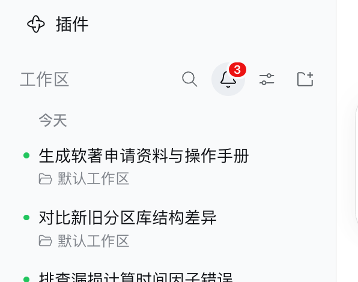
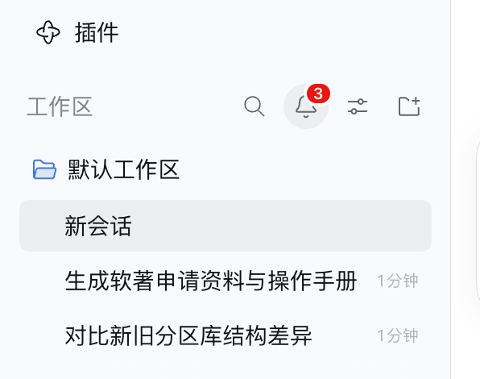
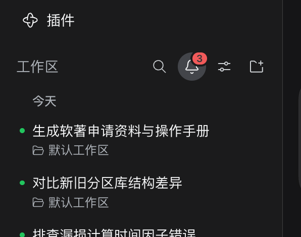

# dsh-activity-bell

[](https://www.npmjs.com/package/dsh-activity-bell)
[](https://www.npmjs.com/package/dsh-activity-bell)
[](./LICENSE)
[](https://github.com/deepseek-ai/deepseek-harness)
<!-- dsh-recommend 的「精选认证」徽章是人工精选才发放的，等 zp-home/dsh-recommend 收录
     出 data/badges/minivv__dsh-activity-bell.certified.json 后启用这一行：
[](https://github.com/zp-home/dsh-recommend)
-->

**给 DSH 侧边栏加一个「活动」铃铛：哪个会话跑完了，铃铛上就有红色数字；点一下，就把左边的列表从「按文件夹分组」换成「按最近结束排序」。**

同时开好几个会话、又跑去干别的的时候，你没法盯着每一个。这个铃铛就负责告诉你：**哪个跑完了、还有几个没看过。**



## 它做了什么

- **角标**：有会话跑完、你还没看过时，铃铛右上角出现红色数字（就是没看的个数）。
- **点铃铛**：铃铛亮起来，侧边栏列表换成「最近活动」—— 按天分组（今天 / 昨天 / 星期几 / 具体日期），最近结束的排最上面，每行是会话标题 + 所属文件夹；跑完还没看的，行首带**绿点**。
- **再点一次**（或按 `Esc`）：回到原来的工作区 / 会话列表。
- **点某一行**：直接打开那个会话；打开后它的绿点和角标数字就减掉。
- **当前打开的会话**：在活动列表里带灰色底，一眼看出自己在哪。
- **鼠标移到某一行**：和官方列表一样出现「置顶 / 归档」按钮；标题太长会慢慢滚动显示完整内容。



深色主题下同样可用：



## 安装

### npm（推荐）

```bash
dsh plugin --profile web add dsh-activity-bell
```

装完重启 `web` profile；页面开着的话刷新一下即可。

### DSH 插件市场

在「设置 → 插件市场」里搜索 **activity bell**，或者看 [DSH 插件市场](https://github.com/dsh-market/dsh-market) / [1024 Store](https://deepseek1024.com/)（条目 `minivv/dsh-activity-bell`）。

### GitHub

```bash
dsh plugin --profile web add github:minivv/dsh-activity-bell
```

仓库里带了构建产物（`lib/`），Git 安装不需要额外跑构建脚本。

### 本地目录

```bash
dsh plugin --profile web add /path/to/dsh-activity-bell
```

## 怎么用

1. 照常干活：在某个会话里发任务，然后切去看别的会话。
2. 任务跑完，铃铛上出现红色数字。
3. 点铃铛看是哪些跑完了（绿点 = 还没看过），点那一行就打开它。
4. 想回去按文件夹找会话，再点一次铃铛（或按 `Esc`）。

## 什么时候算「没看过」，什么时候清掉

- **算没看过**：只要一个会话从「运行中」变成「结束」，就先记一次 —— 不管当时你是不是正看着它。
- **清掉**：你打开了这个会话（在哪个列表点开都算）、它又开始跑、或者它从列表里消失了。

## 和官方列表保持一致的地方

活动列表接管的是同一个位置，所以这些行为都和官方列表一样：

- 行宽、圆角、鼠标移上去的灰底。行宽是**打开时实测官方行的盒子**得来的，换主题、换皮肤、官方调整内边距都会自动跟上。
- 标题过长的滚动显示、行尾的「置顶 / 归档」按钮、置顶行末尾的图钉标记。
- 可见范围：空白「新会话」占位、子代理来源的会话、已归档会话都不显示。

## 已知限制

- **侧边栏折叠成 56px 轨道时看不到铃铛**：那个位置的角标已被官方的「桌面更新提示」占用，插件抢不过来，所以轨道模式下没有未读数。
- **未读不跨刷新保存**：和官方一样，刷新页面后重新开始计数。
- 活动列表里提供置顶、归档、打开会话。重命名 / 分叉仍在原来的工作区列表里 —— 官方没有把这两个操作开放给其它插件。

## 开发

```sh
npm install
npm run verify   # typecheck + build + 35 个测试
```

源码结构：

- `src/activity-model.ts` —— 纯函数：从会话、会话状态、工作区三个快照算出「按天分组的活动列表」。
- `src/client/anchors.ts` —— 找到侧边栏列表的位置并挂载界面（官方没有在搜索按钮旁留扩展位，所以铃铛是挂到 DOM 上的）。
- `src/client/ActivityBell.tsx` —— 铃铛按钮 + 活动列表，以及未读的记账。
- `src/client/completions.ts` —— 监听「运行中 → 结束」，维护未读集合。

## English

A sidebar activity bell for the DeepSeek Harness Web UI:

- **Badge** — a session that finishes raises a red count on the bell.
- **Click** — the sidebar list switches from workspace grouping to a day-grouped activity list, newest first, with a green dot on completions you have not opened yet.
- **Click again** (or `Esc`) — back to the workspace list. Rows keep the shipped affordances (pin, archive, hover title reveal), and the session you have open shows the shipped selected fill.

```sh
dsh plugin --profile web add dsh-activity-bell
```

## 相关插件

- **[dsh-agent-skills](https://github.com/minivv/dsh-agent-skills)** —— 在 DSH 设置页里浏览、启停和管理本地 Agent Skills（Claude Code / Codex / Gemini CLI 等技能目录）。

## 链接

- [GitHub](https://github.com/minivv/dsh-activity-bell)
- [npm](https://www.npmjs.com/package/dsh-activity-bell)
- [WeiSpot](https://weispot.vercel.app/projects/dsh-activity-bell)
- [DSH 插件市场](https://github.com/dsh-market/dsh-market)
